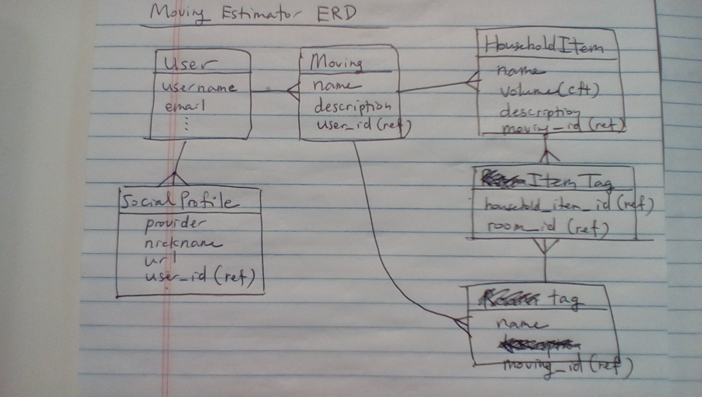
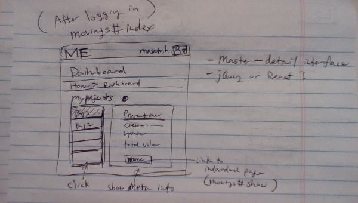
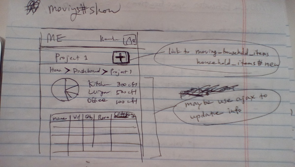
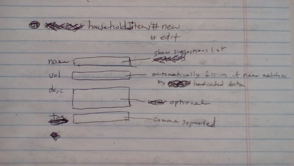

# estimate_moving

- A web application that calculates total volume of your household items.
- Perfect for preparing house moving.
- Easy to use on mobile devices as well as on larger devices.

## Wireframe






## User story

```yaml
Bronze:
  - Minimum Viable Product (MVP)
  - The bare necessities to be functional and meet requirements.
  - Does it meet the business requirements in order to start an effective feedback loop?

Silver:
  - Improve user experience
  - What can we push to the next iteration? Where can we add value?

Gold:
  - Nice-to-haves.
  - Next steps to maximize return on investment (ROI).
```

#### Bronze
- I want a table that displays all my household items.
- I want to be able to create multiple moving projects.
- I want to create/edit/delete household items from my moving projects.
- I want to obtain the total volume of each moving project.
- I want to add tags to household items.

#### Silver
- I want to see my moving data for each moving project as graphs/charts under each tag.
- I want to have my own account to manage my moving projects.
- I want my account to be private (invisible from other users).
- I want to create/edit/delete my moving projects from my account.

#### Gold
- I want to log in via Facebook or twitter.
- I want to be able to duplicate moving project as necessary.
- I want to be able to sort my table by tag, volume and name.
- I want to be able to filter my table by a search term.
