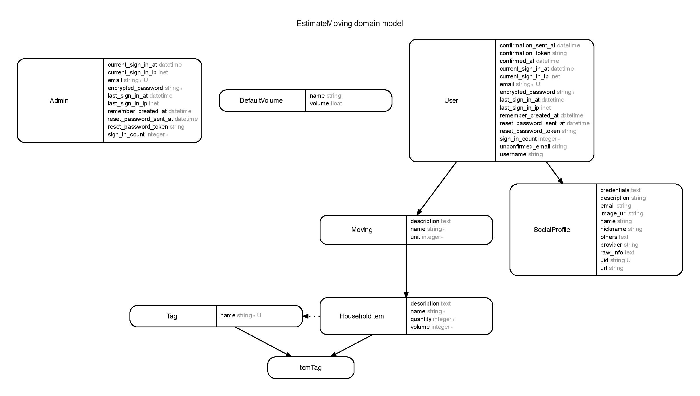

# estimate_moving

- A web application that calculates total volume of your household items.
- Perfect for preparing house moving.
- Easy to use on mobile devices as well as on larger devices.

---

## Current features
- Allows each user to have an account, where the user can hold multiple moving projects.
- Lists all my household items for each moving project.
- Displays the total volume of each moving project.
- Allows user to add tags to household items and the items can be filtered by tag.
- sign up and log in via Twitter.
- graphs/charts for moving volume data.

### Pending features
- CSV download
- Better and faster UI

## Demo

`https://estimate-moving.herokuapp.com/`

Log in as example user:
- Email - `user@example.com`
- Password - `password`

## Local setup

```bash
$ git clone git@github.com:mnishiguchi/estimate_moving.git
$ cd estimate_moving
$ bundle install --without production
$ [bundle exec] rake db:create
$ [bundle exec] rake db:migrate
$ [bundle exec] rake db:seed
$ rails s
```

## Models



## Turbolinks 5

[Turbolinks 5: I Can’t Believe It’s Not Native! (Video)](http://confreaks.tv/videos/railsconf2016-turbolinks-5-i-can-t-believe-it-s-not-native)

> Learn how Turbolinks 5 enables small teams to deliver lightning-fast Rails applications in the browser, plus high-fidelity hybrid apps for iOS and Android, all using a shared set of web views.
